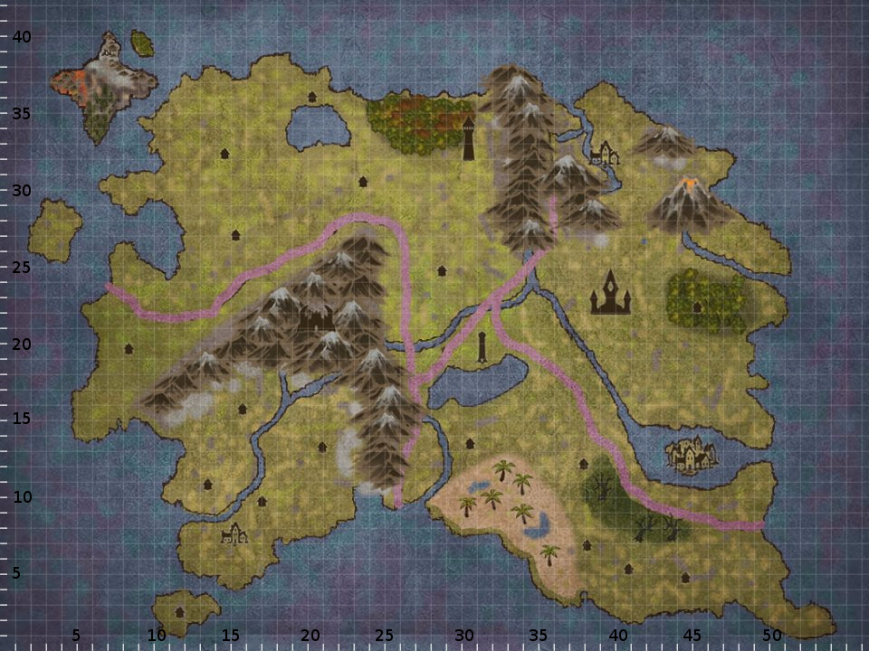

# D&D Socity
[](https://www.facebook.com/DandDSoc/)
 
## about
D&D Soc is a regularly meeting group for anyone interested in tabletop RPGs! Everything from D&D to Call of Cathulu and anything else you want to play!


> "D&D is the most fun you can have with your brain" ~ [Matthew Colville]

<aside class="notice">
# `WARNING: this repo may contain spoilers for players, if you are a player who is currently in a world based on this one it is for your own fun and enjoyment we surgest you dont read`
</aside>

## The Multiverse
>"you can do anything, but so can everyone else" ~~

as this is ment to be a resorce for DMs and not a strict rule set, eventuly descrepancys will occour between two diffrent games, i.e one DM blows up Adventure Island, the rest of the DMs using this resorce dont have to remove Adventure Island from their game. instead at the point where continuity can nolonger be maintained a new git branch will be made to facilitate this parralel world.
further more if two groups with slightly differing worlds decide they want to meet up its as simple as merging the branches untill the partys want to split again at which point a new brach can be made.



## How To Use This Repo
for the most part its self explanitory, each ymal file contains information about the world in terms of; setting, lore, props and just about any other useful resorce. Each
- Ymal file Should Only Contain Information Pertaining To The File It Is About,
any other information should be refrenced by using an understandable identifyer and the path to the relevent file that describes the element in more detail.
exsample: 
#### bad
Overview.ymal:
```yaml
---
-
    Kingdom: "Adventure Island"
   'People of intrest': ['Kalas : Farmer Human, an y alignment Armor Class: 11 (Padded) Hit Points: 5 (1d8 +1) Speed: 30ft (9m / 6 sqr) Pro ciency: +2 STR DEX CON 13 (+1) 11 (+0) 13 (+1) INT WIS CHA 11 (+0) 12 (+1) 9 (-1) Skills: Nature +2 Animal Handling +3  Challenge: 1/8 (25 XP)  Racial Features Ability Modi ers: +1 to all Languages: speaks Common and one extra. Actions Javelin. Melee Weapon Attack +3 to hit, range 30/120, one target. Hit: 4 (1d6 +1 ) piercing damage. Properties: Thrown: range 30/120, It''s actually a pitchfork,']

```
#### good
Overview.yaml
```yaml
---
-
    Kingdom: "Adventure Island"
   'People of intrest': ['./Kalas.yaml']

```
Kalas.yaml
```yaml
---
-
    Profession: Farmer 
    Race: Human 
    Alignment: lawful good
    Armor Class: '11 (Padded)' 
    Hit Points: '5 (1d8 +1)' 
    Speed: '30ft (9m / 6 sqr)' 
    Profciency: +2 
    STR: 13 (+1) 
    DEX: 11 (+0)
    CON: 13 (+1)  
    INT: 9 (-1)
    WIS:  12 (+1)
    CHA: 11 (+0)  
    Skills: ['Nature +2', 'Animal Handling +3'] 
    Challenge: 1/8 (25 XP) 
    Racial Features Ability Modifers: +1 to all
    Languages: speaks Common and one extra.
    Actions: ['Javelin. Melee Weapon Attack +3 to hit, range 30/120, one target. Hit: 4 (1d6 +1 ) piercing damage. Properties: Thrown: range 30/120, It''s actually a pitchfork']
```


## links you will Enevitably need:
### Git:
- http://ohshitgit.com/
- https://try.github.io/
### D&D:
- [Matthew Colville]
- [Matt Mercer]
- http://www.inkarnate.com
- http://hexographer.com
- http://rpgtinker.com/
- http://www.gozzys.com/
- http://davesmapper.com/
- http://www.lastgaspgrimoire.com/do-not-take-me-for-some-turner-of-cheap-tricks/
- [Complete Arcane 3.5]
- http://www.rptools.net/
- [genral rpg images]
- http://rpgvirtualtabletop.wikidot.com/mapping-software
- [Handel Animal 3.5]
- [pixel sprite generator]


   [pixel sprite generator]: <https://github.com/zfedoran/pixel-sprite-generator>
   [Handel Animal 3.5]: <http://brilliantgameologists.com/boards/index.php?topic=10396.0>
   [genral rpg images]: <https://www.reddit.com/r/DnD/comments/1zdxej/i_just_finished_sorting_out_a_2_gb_archive_of/?st=iw6nwyqd&sh=e2a48fa2>
   [Complete Arcane 3.5]:<http://awakenvideo.org/pdf/DnD%203.5e%20and%20you%20are%20welcome/DnD%20DM%203.5e%20Essentials---Dungeons%20and%20Dragons%20Dungeon%20Master%203.5%20Essentials/books/Complete%20Arcane%20v3.5.pdf>
   [Matthew Colville]: <https://www.youtube.com/user/mcolville>
   [Matt Mercer]: <https://www.youtube.com/playlist?list=PL7atuZxmT9570U87GhK_20NcbxM43vkom>
